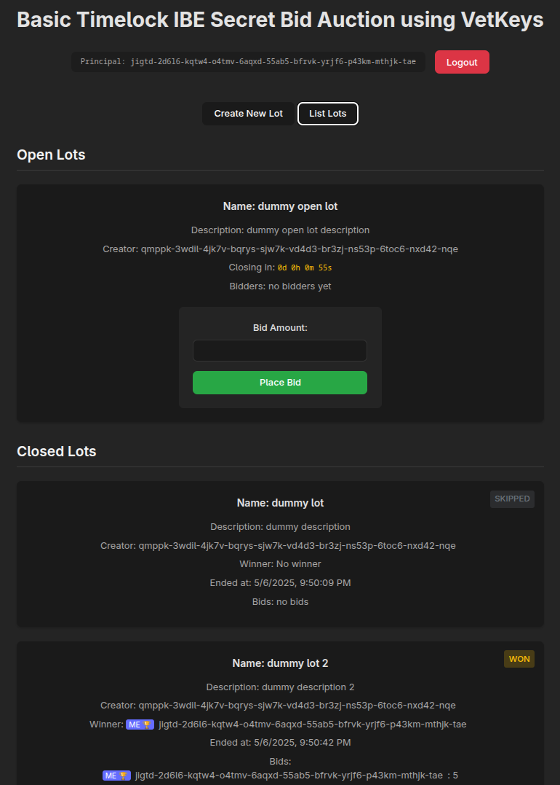

# Basic Timelock Identity Based Encryption

> [!IMPORTANT]  
> These support libraries are under active development and are subject to change. Access to the repositories have been opened to allow for early feedback. Please check back regularly for updates.

The **Basic Timelock IBE** example demonstrates how to use **[VetKeys](https://internetcomputer.org/docs/building-apps/network-features/encryption/vetkeys)** to implement a secret-bid auction using Identity Based Encryption (IBE) on the **Internet Computer (IC)**. This application allows users authenticated with their **Internet Identity Principal** to create auction lots with a description and deadline, and other users to place a secret bid for the lot. The bids in this example are just dummy integer values, contrary to real-world use cases where users would place bids holding some value.

This canister (IC smart contract) ensures that:
1. Only authorized users can create auction lots and place secret bids until the lot is closed.
2. The bids stay secret until the lot is closed.
3. The winner is chosen fairly among all the placed bids, once the lot closes and the canister decrypts the secret bids. Note that once secret bids are decrypted they inherently become public.

Note that generally it is possible for a canister to request a decryption key to decrypt secrets at any time.
The code of smart contract determines the rules for when the decryption happens.
In this example, the decryption happens only after the lot is closed and does not accept new bids.
A canister functionality for decrypting secrets can be detected by inspecting the code and, therefore, it is crucial that canisters using VetKeys have their code public to allow to verify that the canister handles secrets in a secure and intended way.



## Features

- **Secret Bid Placement**: Uses IBE capabilities of IC Vetkeys to encrypt messages that can only be decrypted by the intended recipient.
- **Bid-Id-Based Encryption**: Each bid gets a unique bid id, and the secret bids are encrypted to the bid id as the public key identifier.
- **Time-Based Access Control**: Messages can only be decrypted after a specified time period has elapsed.

## Efficiency

- **Reducing the Number of VetKeys for Decryption**: In the current implementation, the bids are encrypted with the unique public key corresponding to the bid id. This is not strictly necessary and can be optimized if there is a need. For example, the bids could be decrypted based on a timestamp, e.g., every minute. All bids that were closed in that minute would be decrypted with one VetKey. The required change would be to encrypt bids with a predefined timestamp as the public key identifier instead of the bid id.
- **Public Key Retrieval**: It is possible to use one public key to encrypt bids for multiple auction lots. The subkey derivation for a concrete lot can happen on the client side, i.e., in the frontend. It is already the case in this example. A further, minor optimization is possible by hardcoding the root public key of the IC, removing the need and the latency for obtaining the public key from the IC.

## Setup

### Prerequisites

- [Internet Computer software development kit](https://internetcomputer.org/docs/building-apps/getting-started/install)
- [npm](https://www.npmjs.com/package/npm)

### Install Dependencies

```bash
npm install
```

### Deploy the Canisters

Run the local deployment script, which starts the local development environment (`dfx`) if necessary, builds both backend and frontend (asset) canisters, and installs them locally, and prints the URL to the frontend to the terminal.
```bash
bash deploy_locally.sh
```

Note that currently in a local deployment, the [chainkey *testing* canister](https://github.com/dfinity/chainkey-testing-canister) is used to mock the VetKD protocol.

## Example Components

### Backend

The backend consists of a canister that:
* Lets users create auction lots with a description and duration.
* Stores at most one encrypted bid from any authenticated user except the creator of the lot. Secret bids failing to decrypt are ignored. If a user provides multiple bids, only the last one is considered. The ciphertexts for secret bids of unexpectedly large size are rejected. Bids to expired lots are rejected.
* Allows users to retrieve the status of the lot, including the winner and the decrypted bids once the lot is closed.
* A timer inside the canister periodically runs and takes one closed lot that it decrypts. If multiple users provide the highest bid, the bid that was placed first wins.

### Frontend

The frontend is a vanilla typescript application providing a simple interface for:
* Creating an auction lot with a specified duration
* Viewing open and closed lots including winners and bidders
* Placing a secret bid for open lots created by other users

To run the frontend in development mode with hot reloading (after running `deploy_locally.sh`):

```bash
npm run dev
```

## Additional Resources

- **[Basic IBE Example](../basic_ibe/)** - If you are interested in using IBE with users decrypting secrets.
- **[What are VetKeys](https://internetcomputer.org/docs/building-apps/network-features/encryption/vetkeys)** - For more information about VetKeys and VetKD. 